**Defining the Question**

The goal is to identify which individuals are most likely to click on
ads displayed in a blog based on data that was previously collected on
the site.

**Defining the Metrics for Success**

The project will be deemed successful when the characteristics of
individuals likely to click ads will be identified through multivariate
exploratory data analysis.

**Recording the Experimental Design**

1.  Reading in the data
2.  Checking for missing values
3.  Checking for duplicates
4.  Checking for outliers
5.  Univariate Exploratory Data Analysis
6.  Bivariate Exploratory Data Analysis
7.  Multivariate Exploratory Data Analysis
8.  Conclusion and Recommendation

**Is the data appropriate to answer the question?**

Yes, the data is suitable for answering the question as the data was
collected on the site that will be used to host the cryptography online
class advertisement.

**Loading the required libraries**

``` r
# Loading libraries
library(readr)
library(ggplot2)
library(dplyr)
library(tibble)
library(stringr)
library(tidyr)
library(MASS)
library(lubridate)
```

**Reading in the data**

``` r
# Reading the data
ads <- read_csv(file = 'C:/Users/Githu/Downloads/advertising.csv')
```

**Checking the Data**

``` r
# Determining the number of records
dim(ads)
```

    ## [1] 1000   10

``` r
# Displaying the structure of the dataset
str(ads)
```

    ## tibble [1,000 x 10] (S3: spec_tbl_df/tbl_df/tbl/data.frame)
    ##  $ Daily Time Spent on Site: num [1:1000] 69 80.2 69.5 74.2 68.4 ...
    ##  $ Age                     : num [1:1000] 35 31 26 29 35 23 33 48 30 20 ...
    ##  $ Area Income             : num [1:1000] 61834 68442 59786 54806 73890 ...
    ##  $ Daily Internet Usage    : num [1:1000] 256 194 236 246 226 ...
    ##  $ Ad Topic Line           : chr [1:1000] "Cloned 5thgeneration orchestration" "Monitored national standardization" "Organic bottom-line service-desk" "Triple-buffered reciprocal time-frame" ...
    ##  $ City                    : chr [1:1000] "Wrightburgh" "West Jodi" "Davidton" "West Terrifurt" ...
    ##  $ Male                    : num [1:1000] 0 1 0 1 0 1 0 1 1 1 ...
    ##  $ Country                 : chr [1:1000] "Tunisia" "Nauru" "San Marino" "Italy" ...
    ##  $ Timestamp               : POSIXct[1:1000], format: "2016-03-27 00:53:11" "2016-04-04 01:39:02" ...
    ##  $ Clicked on Ad           : num [1:1000] 0 0 0 0 0 0 0 1 0 0 ...
    ##  - attr(*, "spec")=
    ##   .. cols(
    ##   ..   `Daily Time Spent on Site` = col_double(),
    ##   ..   Age = col_double(),
    ##   ..   `Area Income` = col_double(),
    ##   ..   `Daily Internet Usage` = col_double(),
    ##   ..   `Ad Topic Line` = col_character(),
    ##   ..   City = col_character(),
    ##   ..   Male = col_double(),
    ##   ..   Country = col_character(),
    ##   ..   Timestamp = col_datetime(format = ""),
    ##   ..   `Clicked on Ad` = col_double()
    ##   .. )

``` r
# Viewing the top of our dataset
knitr::kable(
  ads[1:5, ]
  )
```

|  Daily Time Spent on Site|  Age|  Area Income|  Daily Internet Usage| Ad Topic Line                         | City           |  Male| Country    | Timestamp           |  Clicked on Ad|
|-------------------------:|----:|------------:|---------------------:|:--------------------------------------|:---------------|-----:|:-----------|:--------------------|--------------:|
|                     68.95|   35|     61833.90|                256.09| Cloned 5thgeneration orchestration    | Wrightburgh    |     0| Tunisia    | 2016-03-27 00:53:11 |              0|
|                     80.23|   31|     68441.85|                193.77| Monitored national standardization    | West Jodi      |     1| Nauru      | 2016-04-04 01:39:02 |              0|
|                     69.47|   26|     59785.94|                236.50| Organic bottom-line service-desk      | Davidton       |     0| San Marino | 2016-03-13 20:35:42 |              0|
|                     74.15|   29|     54806.18|                245.89| Triple-buffered reciprocal time-frame | West Terrifurt |     1| Italy      | 2016-01-10 02:31:19 |              0|
|                     68.37|   35|     73889.99|                225.58| Robust logistical utilization         | South Manuel   |     0| Iceland    | 2016-06-03 03:36:18 |              0|

``` r
# Viewing the bottom of our dataset
knitr::kable(
  ads[995:1000, ] 
  )
```

|  Daily Time Spent on Site|  Age|  Area Income|  Daily Internet Usage| Ad Topic Line                        | City          |  Male| Country                | Timestamp           |  Clicked on Ad|
|-------------------------:|----:|------------:|---------------------:|:-------------------------------------|:--------------|-----:|:-----------------------|:--------------------|--------------:|
|                     43.70|   28|     63126.96|                173.01| Front-line bifurcated ability        | Nicholasland  |     0| Mayotte                | 2016-04-04 03:57:48 |              1|
|                     72.97|   30|     71384.57|                208.58| Fundamental modular algorithm        | Duffystad     |     1| Lebanon                | 2016-02-11 21:49:00 |              1|
|                     51.30|   45|     67782.17|                134.42| Grass-roots cohesive monitoring      | New Darlene   |     1| Bosnia and Herzegovina | 2016-04-22 02:07:01 |              1|
|                     51.63|   51|     42415.72|                120.37| Expanded intangible solution         | South Jessica |     1| Mongolia               | 2016-02-01 17:24:57 |              1|
|                     55.55|   19|     41920.79|                187.95| Proactive bandwidth-monitored policy | West Steven   |     0| Guatemala              | 2016-03-24 02:35:54 |              0|
|                     45.01|   26|     29875.80|                178.35| Virtual 5thgeneration emulation      | Ronniemouth   |     0| Brazil                 | 2016-06-03 21:43:21 |              1|

``` r
# Standardizing the column names
names(ads) <- str_replace_all(names(ads), c(" " = "_"))
names(ads) <- tolower(names(ads))
colnames(ads)
```

    ##  [1] "daily_time_spent_on_site" "age"                     
    ##  [3] "area_income"              "daily_internet_usage"    
    ##  [5] "ad_topic_line"            "city"                    
    ##  [7] "male"                     "country"                 
    ##  [9] "timestamp"                "clicked_on_ad"

``` r
# Checking for missing values
colSums(is.na(ads))
```

    ## daily_time_spent_on_site                      age              area_income 
    ##                        0                        0                        0 
    ##     daily_internet_usage            ad_topic_line                     city 
    ##                        0                        0                        0 
    ##                     male                  country                timestamp 
    ##                        0                        0                        0 
    ##            clicked_on_ad 
    ##                        0

``` r
# Checking for duplicates
duplicated_rows <- ads[duplicated(ads),]
duplicated_rows
```

    ## # A tibble: 0 x 10
    ## # ... with 10 variables: daily_time_spent_on_site <dbl>, age <dbl>,
    ## #   area_income <dbl>, daily_internet_usage <dbl>, ad_topic_line <chr>,
    ## #   city <chr>, male <dbl>, country <chr>, timestamp <dttm>,
    ## #   clicked_on_ad <dbl>

``` r
# Checking for outliers using a boxplot
ads %>% 
  dplyr::select(daily_time_spent_on_site, daily_internet_usage, age, male) %>%
  tidyr::pivot_longer(., cols = c(daily_time_spent_on_site,daily_internet_usage,age),names_to = "Var", values_to = "Val") %>%
  ggplot(aes(x = Var, y = Val, fill = male)) +
  ggtitle("Boxplot of numerical columns") +
  geom_boxplot()
```

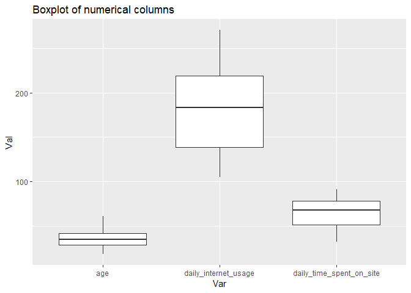

``` r
# Boxplot of the area_income variable
boxplot(ads$area_income)
```

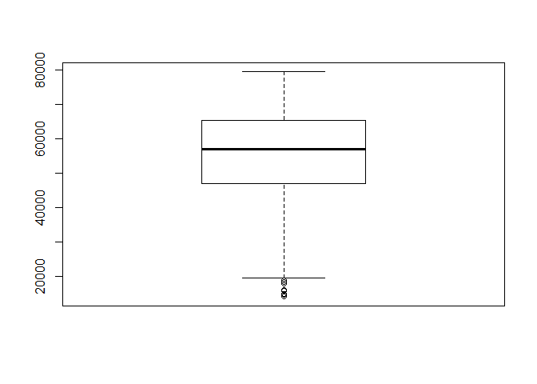

The dataset requires little cleaning. There are no missing values or
duplicates. The columns names have been standardised to have the same
format. Outliers are present in the area income variable only. These are
the entries of individuals with low income. We will work with these
outliers as dropping them means such individuals with lower
incomes(actual potential customers) will not be accounted for.

**Univariate Exploratory Data Analysis**

``` r
# Determining the average age of the visitors
average_age <- mean(ads$age)
paste("The average age of the visitors is", average_age)
```

    ## [1] "The average age of the visitors is 36.009"

``` r
# Determining the average income of the visitors
average_income <- mean(ads$area_income)
paste("The average area income of the visitors is:", average_income)
```

    ## [1] "The average area income of the visitors is: 55000.00008"

``` r
# Determining the average daily time spent on the site
average_time <- mean(ads$daily_time_spent_on_site)
paste("The average daily time spent on the site is:", average_time)
```

    ## [1] "The average daily time spent on the site is: 65.0002"

``` r
# Determining the average daily internet usage
average_usage <- mean(ads$daily_internet_usage)
paste("The average daily internet usage is:", average_usage)
```

    ## [1] "The average daily internet usage is: 180.0001"

``` r
# Determining the frequency count of male column
# 0 is female and 1 is male
table(ads$male)
```

    ## 
    ##   0   1 
    ## 519 481

``` r
# Determining the frequency count of the clicked_ad column
# 0 = did not click ad  and 1 = clicked ad
table(ads$clicked_on_ad)
```

    ## 
    ##   0   1 
    ## 500 500

``` r
# Summary statistics of the dataset
summary(ads)
```

    ##  daily_time_spent_on_site      age         area_income   
    ##  Min.   :32.60            Min.   :19.00   Min.   :13996  
    ##  1st Qu.:51.36            1st Qu.:29.00   1st Qu.:47032  
    ##  Median :68.22            Median :35.00   Median :57012  
    ##  Mean   :65.00            Mean   :36.01   Mean   :55000  
    ##  3rd Qu.:78.55            3rd Qu.:42.00   3rd Qu.:65471  
    ##  Max.   :91.43            Max.   :61.00   Max.   :79485  
    ##  daily_internet_usage ad_topic_line          city          
    ##  Min.   :104.8        Length:1000        Length:1000       
    ##  1st Qu.:138.8        Class :character   Class :character  
    ##  Median :183.1        Mode  :character   Mode  :character  
    ##  Mean   :180.0                                             
    ##  3rd Qu.:218.8                                             
    ##  Max.   :270.0                                             
    ##       male         country            timestamp                  
    ##  Min.   :0.000   Length:1000        Min.   :2016-01-01 02:52:10  
    ##  1st Qu.:0.000   Class :character   1st Qu.:2016-02-18 02:55:42  
    ##  Median :0.000   Mode  :character   Median :2016-04-07 17:27:29  
    ##  Mean   :0.481                      Mean   :2016-04-10 10:34:06  
    ##  3rd Qu.:1.000                      3rd Qu.:2016-05-31 03:18:14  
    ##  Max.   :1.000                      Max.   :2016-07-24 00:22:16  
    ##  clicked_on_ad
    ##  Min.   :0.0  
    ##  1st Qu.:0.0  
    ##  Median :0.5  
    ##  Mean   :0.5  
    ##  3rd Qu.:1.0  
    ##  Max.   :1.0

**Bivariate Exploratory Data Analysis**

``` r
# Bar plot of gender and age
ggplot(data=ads, aes(x=male, y=age)) +
  geom_bar(stat="identity", width=0.5) +
  ggtitle("Barplot of age based on gender")
```

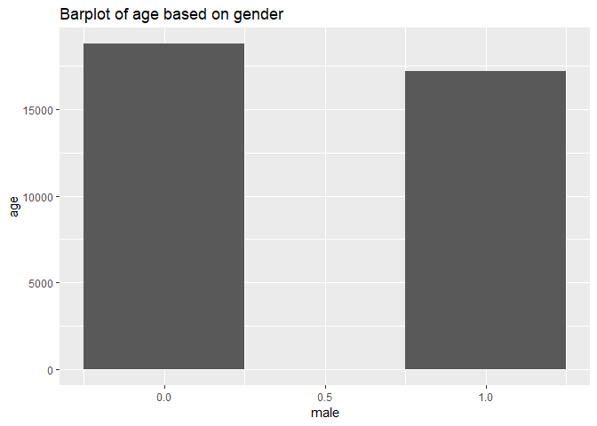

``` r
# Selecting the numerical columns
num_cols <- ads[,c(1, 2, 3, 4)]
colnames(num_cols)
```

    ## [1] "daily_time_spent_on_site" "age"                     
    ## [3] "area_income"              "daily_internet_usage"

``` r
# Correlation matrix of the continous data
cor(num_cols)
```

    ##                          daily_time_spent_on_site        age area_income
    ## daily_time_spent_on_site                1.0000000 -0.3315133   0.3109544
    ## age                                    -0.3315133  1.0000000  -0.1826050
    ## area_income                             0.3109544 -0.1826050   1.0000000
    ## daily_internet_usage                    0.5186585 -0.3672086   0.3374955
    ##                          daily_internet_usage
    ## daily_time_spent_on_site            0.5186585
    ## age                                -0.3672086
    ## area_income                         0.3374955
    ## daily_internet_usage                1.0000000

``` r
# Distribution of area income
hist(ads[ads$clicked_on_ad == 1,]$area_income,xlab = 'Area Income', main = 'Clicked on ads' )
```

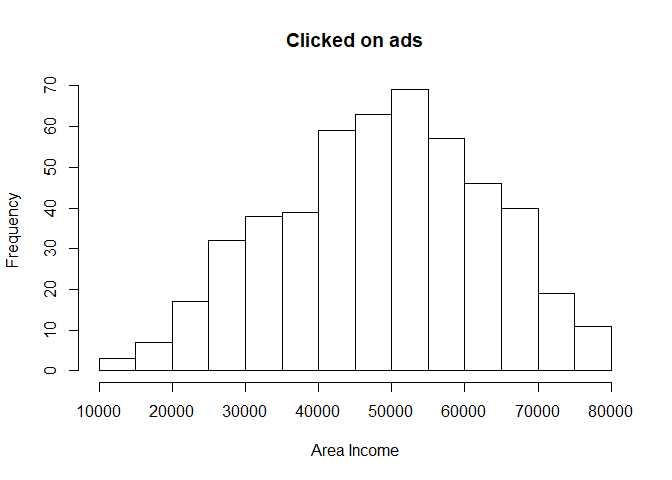

``` r
hist(ads[ads$clicked_on_ad == 0,]$area_income,xlab = 'Area Income', main = 'Did not click ads' )
```

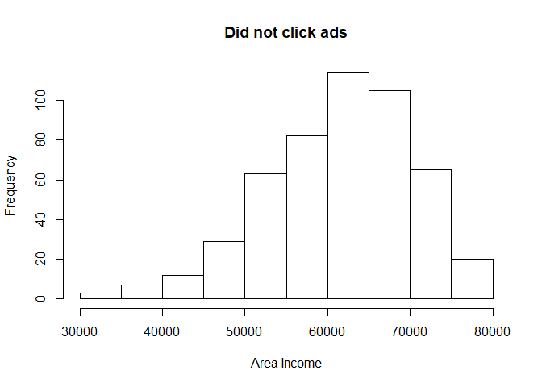

``` r
# Average Income of users based on whether they clicked the ads or not
ads %>%
  group_by(clicked_on_ad) %>%
  summarise(mean(area_income))
```

    ## # A tibble: 2 x 2
    ##   clicked_on_ad `mean(area_income)`
    ##           <dbl>               <dbl>
    ## 1             0              61386.
    ## 2             1              48614.

``` r
# Finding the age group that most clicks on ads using a histogram
ads %>%
  filter(clicked_on_ad == 1) %>%
  ggplot(aes(x=age)) +
  geom_histogram(binwidth = 10, fill="#69b3a2", color="#e9ecef", alpha=0.9) +
  ggtitle("Age Distribution of the users that clicked the ad") 
```

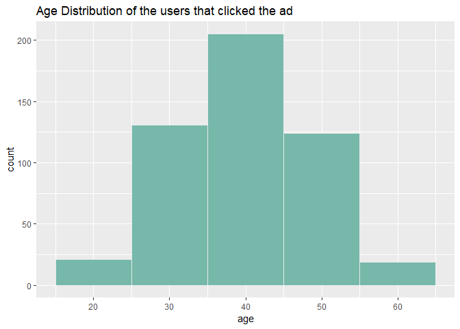

The age group that most clicked on the ads ranges between 35 and 45

``` r
# Finding the age group that did not click on the ads using a histogram
ads %>%
  filter(clicked_on_ad == 0) %>%
  ggplot(aes(x=age)) +
  geom_histogram(binwidth = 10, fill="#69b3a2", color="#e9ecef", alpha=0.9) +
  ggtitle("Age Distribution of the users that did not click the ad")
```

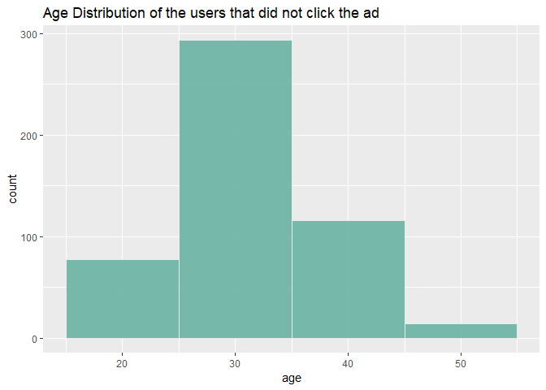

Most users who did not click on the ads are between the age of 25 and 35

``` r
# Distribution of daily time spent on site
ads %>%
  filter(clicked_on_ad == 1) %>%
  ggplot(aes(x=daily_time_spent_on_site)) +
  geom_histogram(binwidth = 10, fill="#69b3a2", color="#e9ecef", alpha=0.9) +
  ggtitle("Distribution of daily time spent on site") 
```

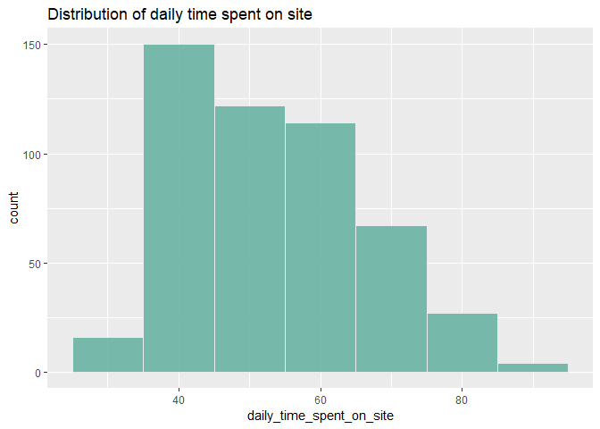

Most of the users who clicked on the ads spent 30 to 50 minutes on the
site daily

``` r
# Histogram of daily internet usage
ads %>%
  filter(clicked_on_ad == 1) %>%
  ggplot(aes(x=daily_internet_usage)) +
  geom_histogram(binwidth = 10, fill="#69b3a2", color="#e9ecef", alpha=0.9) +
  ggtitle("Histogram of daily internet usage")
```

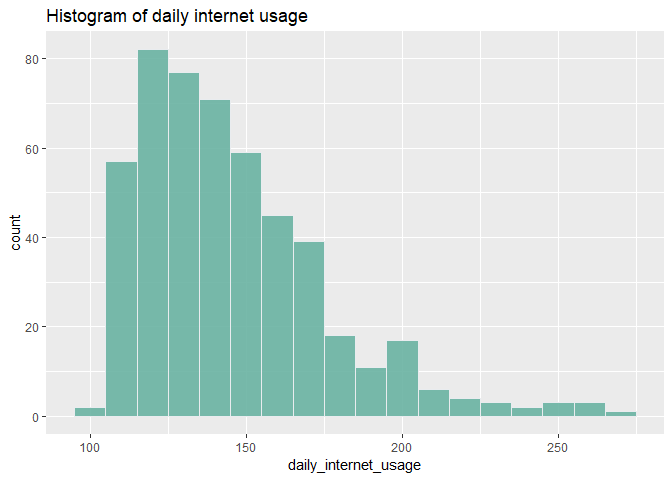

Most users who clicked on the ads spent 120 to 150 minutes daily on the
internet

``` r
# Exploring the timestamp summary
# Plotting the months (clicked_ads = 1)
ads %>%
  filter(clicked_on_ad == 1) %>%
  mutate(ads_months = month(timestamp, label = TRUE)) %>%
  ggplot(aes(x=ads_months)) +
  ggtitle("Months") +
  geom_bar()
```

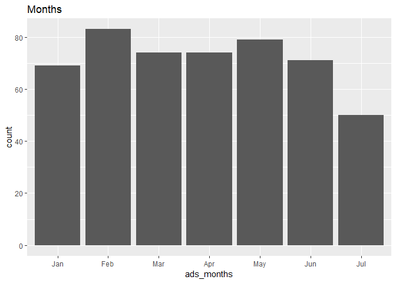

The month of February recorded the highest number of the clicked ads

``` r
# Plotting the weekdays (clicked_ads = 1)
ads %>%
  filter(clicked_on_ad == 1) %>%
  mutate(ads_weekdays = wday(timestamp, label = TRUE)) %>%
  ggplot(aes(x=ads_weekdays)) +
  ggtitle("Weekdays") +
  geom_bar()
```

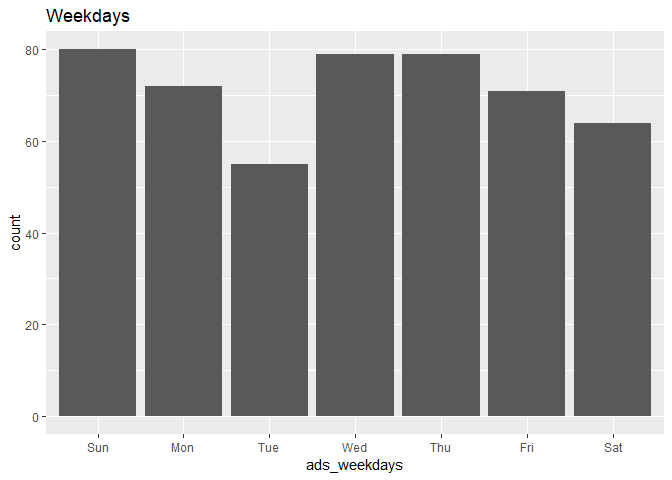

Most ads were clicked on Sunday, Wednesday or Thursday

``` r
# Exploring the time concept 
# Plotting the hour componenr (clicked_ads = 1)
ads %>%
  filter(clicked_on_ad == 1) %>%
  mutate(ads_hours = hour(timestamp)) %>%
  group_by(ads_hours) %>%
  ggplot(aes(x=ads_hours)) +
  ggtitle("Hour") +
  geom_bar()
```

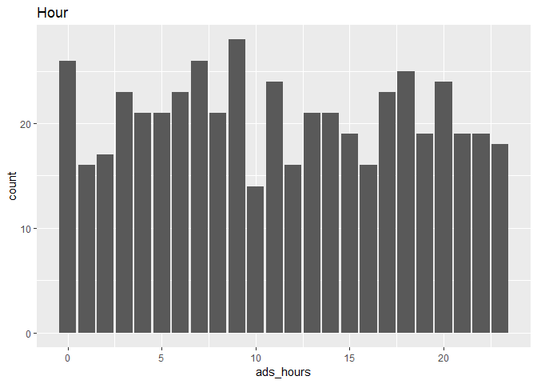

The highest number of clicked ads were recorded between 9th hour and the
lowest at the 10th hour

``` r
# Countries 
ads %>%
  dplyr::select(country, clicked_on_ad) %>%
  filter(clicked_on_ad == 1) %>%
  group_by(country) %>%
  summarise(n=n()) %>%
  arrange(desc(n))
```

    ## # A tibble: 215 x 2
    ##    country           n
    ##    <chr>         <int>
    ##  1 Australia         7
    ##  2 Ethiopia          7
    ##  3 Turkey            7
    ##  4 Liberia           6
    ##  5 Liechtenstein     6
    ##  6 South Africa      6
    ##  7 Afghanistan       5
    ##  8 France            5
    ##  9 Hungary           5
    ## 10 Mayotte           5
    ## # ... with 205 more rows

``` r
ads %>%
  dplyr::select(city, clicked_on_ad, country) %>%
  filter(clicked_on_ad == 1) %>%
  group_by(city) %>%
  summarise(n=n()) %>%
  arrange(desc(n))
```

    ## # A tibble: 490 x 2
    ##    city             n
    ##    <chr>        <int>
    ##  1 Lake David       2
    ##  2 Lake James       2
    ##  3 Lisamouth        2
    ##  4 Michelleside     2
    ##  5 Millerbury       2
    ##  6 Robertfurt       2
    ##  7 South Lisa       2
    ##  8 West Amanda      2
    ##  9 West Shannon     2
    ## 10 Williamsport     2
    ## # ... with 480 more rows

The countries with relatively higher number of users that clicked the
ads include: Australia, Ethiopia, Turkey, Liberia, Liechenstein, South
Africa, Afghanistan, France, Hungary and Mayotte.

**Conclusion**

The characteristics of the blog’s users that are likely to click on the
ads include:

1.  The user is female
2.  Ages between 35 and 45 years
3.  Has an income ranging from 40,000 to 60,000
4.  Spends 30 to 50 minutes daily on the site
5.  Spends 120 to 150 minutes daily on the internet
6.  Visits the blog either on a Sunday, Wednesday or Thursday
7.  Visits the blog in early morning hours
8.  Their country location is among the following countries:Australia,
    Ethiopia, Turkey, Liberia, Liechenstein, South Africa, Afghanistan,
    France, Hungary and Mayotte.

**Recommendations**

Implement the likelihood characteristics mentioned above to enhance
targeted advertising.
